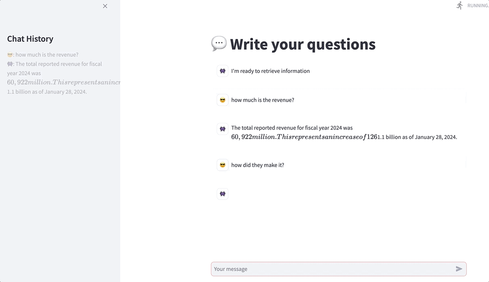
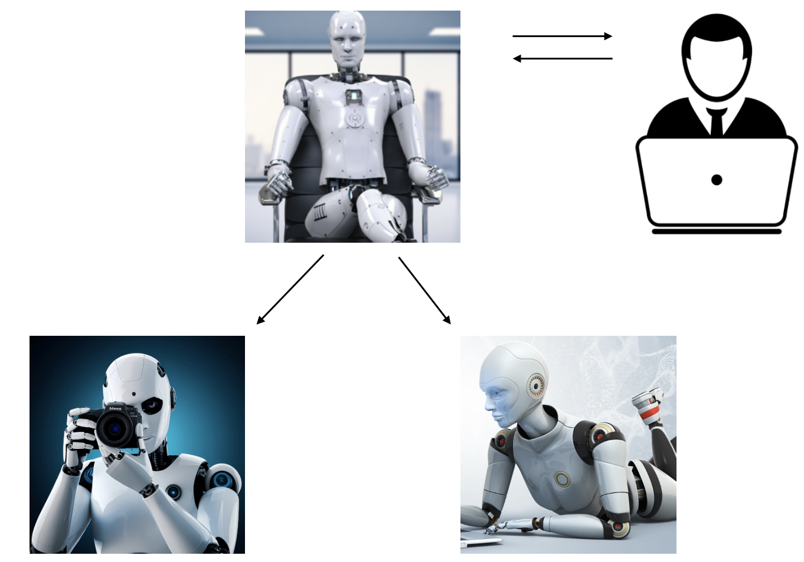
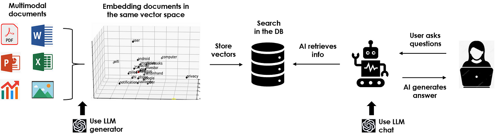

# 使用 Python 的生成式人工智能

在这个代码库中，你可以找到一些关于生成式人工智能 (GenAI) 和大语言模型 (LLM) 应用的实用示例。  
所有项目均在 [AI悦创](https://bornforthis.cn/) 上有详细文档。

---

## **[LLM 聊天机器人](https://github.com/AndersonHJB/BornforthisData/tree/main/%E5%85%AC%E4%BC%97%E5%8F%B7/2025%E5%B9%B4%E6%96%87%E7%AB%A0%E8%B5%84%E6%96%99/05-%E4%BD%BF%E7%94%A8%20Python%20%E7%9A%84%20GenAI%EF%BC%9A%E4%BB%8E%E5%A4%B4%E5%BC%80%E5%A7%8B%E6%9E%84%E5%BB%BA%E4%BB%A3%E7%90%86%EF%BC%88%E5%AE%8C%E6%95%B4%E6%95%99%E7%A8%8B%EF%BC%89/GenerativeAI/Chatbot)**  
在你的笔记本电脑上使用 Ollama 和语音识别技术构建一个语音助手 LLM 聊天机器人。  

---

## **[智能代理 (Agents)](https://github.com/AndersonHJB/BornforthisData/tree/main/%E5%85%AC%E4%BC%97%E5%8F%B7/2025%E5%B9%B4%E6%96%87%E7%AB%A0%E8%B5%84%E6%96%99/05-%E4%BD%BF%E7%94%A8%20Python%20%E7%9A%84%20GenAI%EF%BC%9A%E4%BB%8E%E5%A4%B4%E5%BC%80%E5%A7%8B%E6%9E%84%E5%BB%BA%E4%BB%A3%E7%90%86%EF%BC%88%E5%AE%8C%E6%95%B4%E6%95%99%E7%A8%8B%EF%BC%89/GenerativeAI/Agents_WebSearching)**  
创建一个 AI 团队，在无需 GPU 的情况下，在你的笔记本电脑上自动化几乎任何任务。  

---

## **[RAG（检索增强生成）](https://github.com/AndersonHJB/BornforthisData/tree/main/%E5%85%AC%E4%BC%97%E5%8F%B7/2025%E5%B9%B4%E6%96%87%E7%AB%A0%E8%B5%84%E6%96%99/05-%E4%BD%BF%E7%94%A8%20Python%20%E7%9A%84%20GenAI%EF%BC%9A%E4%BB%8E%E5%A4%B4%E5%BC%80%E5%A7%8B%E6%9E%84%E5%BB%BA%E4%BB%A3%E7%90%86%EF%BC%88%E5%AE%8C%E6%95%B4%E6%95%99%E7%A8%8B%EF%BC%89/GenerativeAI/RAG)**  
使用多模态数据构建你自己的 ChatGPT，并在你的笔记本电脑上运行，无需 GPU。  

